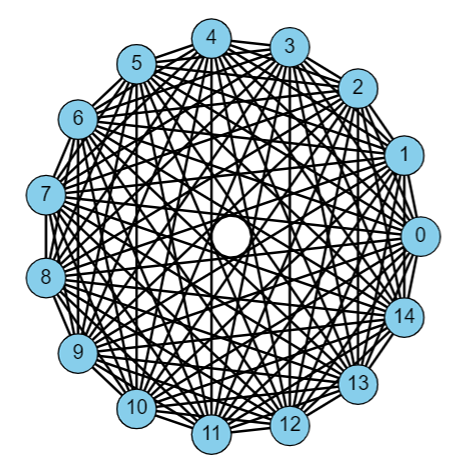
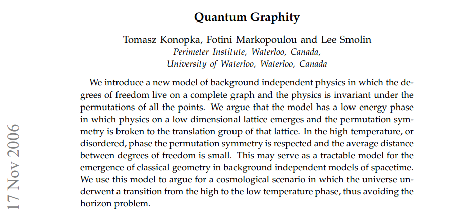
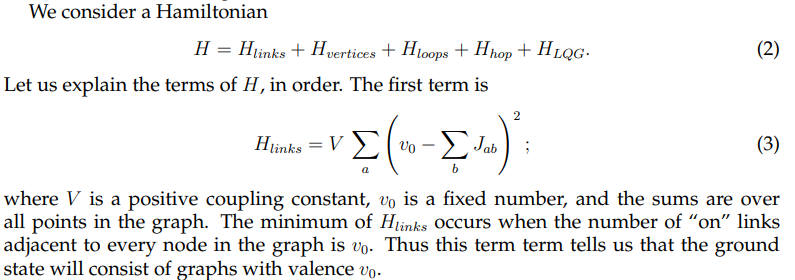
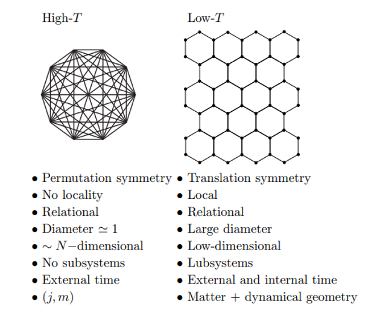

# Background-Independent-Quantum-Gravity-via-Quantum-Graphity
Gather papers and codes around Quantum-Graphity / background-independent-spin-system approaches to Quantum Gravity and Emergent Gravity

## Overview

In the Quantum Graphity approach to Quantum Graivty, originally formulated by Fontini Markopoulou, in collaboration with Tomasz Konopka and Lee Smolin,
space and graivity emerge from a pre-geometric state that is modeled as a background-independent spin system in analogy with the Ising Model in 
solid state physics. The idea is that the Big Bang was in fact a phase transition, termed geometrogenesis, in which a fully-connected graph representing
the primordial elements of existence, begins to "turn off" edges, perhaps transferring the energy of the turned-off edges into matter, and eventually
transitioning into the three-dimensional space that we experience today in our universe. This approach provides an alternative to cosmic inflation for 
solving the Horizon Problem because all points in our current spacetime were in contact prior to the birth of this current phase of the Universe via the fully connected graph.

We can visualize the pre-spatial primordial graph with NetworkX in Python,

We can simulate the emergence of our three-dimensional world, geometrogenesis, by evolving the graph by removing edges (links) from the graph according to the Quantum Graphity 
Hamiltonian,

The low-temperatue phase corresponds to Universe today,

This model of geometrogenesis and Quantum Gravity can be evolved in a number of interesting directions, 
including a derivation of the emergence of the speed of light (C) and a toy model of a black hole. 

## References

Konopka, Tomasz, Fotini Markopoulou, and Lee Smolin. "Quantum graphity." arXiv preprint hep-th/0611197 (2006).

Konopka, Tomasz, Fotini Markopoulou, and Simone Severini. "Quantum graphity: a model of emergent locality." Physical Review D 77, no. 10 (2008): 104029.

Markopoulou, Fotini. "New directions in background independent quantum gravity." Approaches to quantum gravity (2009): 129-149. (https://arxiv.org/abs/gr-qc/0703097)

Hamma, Alioscia, and Fotini Markopoulou. "Background-independent condensed matter models for quantum gravity." New Journal of Physics 13, no. 9 (2011): 095006. (https://iopscience.iop.org/article/10.1088/1367-2630/13/9/095006/meta)

Caravelli, Francesco, and Fotini Markopoulou. "Properties of quantum graphity at low temperature." Physical Review D 84, no. 2 (2011): 024002.

Quach, James Q., Chun-Hsu Su, Andrew M. Martin, and Andrew D. Greentree. "Domain structures in quantum graphity." Physical Review D 86, no. 4 (2012): 044001.

Wilkinson, Samuel A., and Andrew D. Greentree. "Energetics of the quantum graphity universe." Physical Review D 90, no. 12 (2014): 124003.

Wilkinson, Samuel A., and Andrew D. Greentree. "Geometrogenesis under quantum graphity: Problems with the ripening universe." Physical Review D 92, no. 8 (2015): 084007.